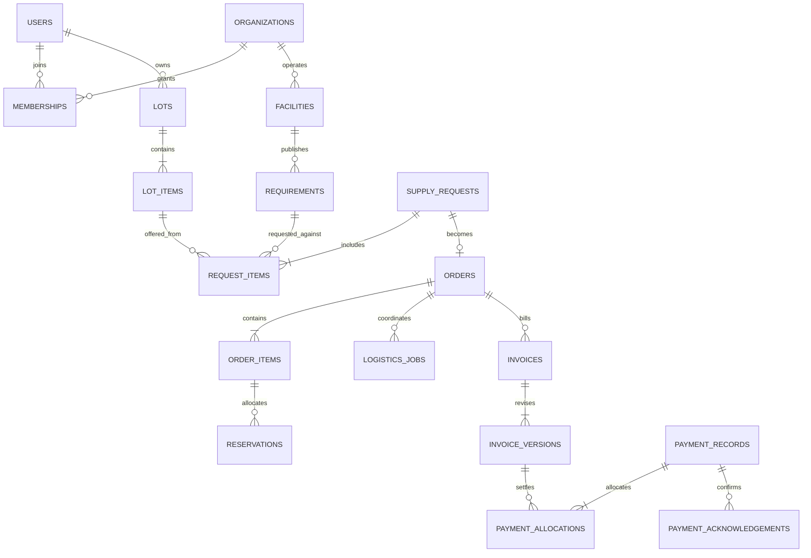

# E-Waste Marketplace: database and storage design

Planning draft, 24 September 2026. This is a logical design, not an applied SQL migration. [Screen requirements and delivery plan](production-requirements-plan.md) define the product behavior. User-confirmed rules: recycler pays logistics separately; Freedom Value records external payments; collector confirms receipt; acceptance does not lock price.

## 1. Storage and service boundaries

| Layer | Data and responsibility | Format |
|---|---|---|
| Native Android | Screens, local drafts, cached permitted records and persistent retry queue | Native Views; local SQLite/Room records and private app files; encrypted session storage |
| Cloudflare Worker | Authentication, authorization, validation, matching, state transitions, file access and Gemini proxy | Versioned JSON API; client never supplies authoritative owner/role/payment totals |
| D1 | Users, facilities, taxonomy, requirements, lots, requests, orders, logistics, invoice/payment metadata and history | Relational SQLite tables, foreign keys, constrained values and indexed queries |
| Private R2 | Lot photos, handover evidence, invoice PDFs/images and payment proof | Validated JPEG/PNG and PDF as applicable; database stores object key, type, size and checksum |
| Gemini | Broad/detailed suggestions from permitted image inputs | Structured validated output saved with model, prompt and taxonomy version; human decision stored separately |
| Operations portal | Staff views and commands against the same API | Restricted browser interface; no direct public database access |

One modular Worker API is sufficient initially; separate logical modules for identity, catalogue, marketplace, logistics, settlement and reporting do not require separate microservices. Push/SMS delivery is external integration behind an adapter. In-app notifications are durable records; delivery retries use a durable outbox and a configured worker/scheduled processor.

Technical basis checked 24 September 2026: [D1 prepared statements and batch API](https://developers.cloudflare.com/d1/worker-api/d1-database/), [R2 objects](https://developers.cloudflare.com/r2/objects/), [Android offline data guidance](https://developer.android.com/topic/architecture/data-layer/offline-first), [Gemini image inputs](https://ai.google.dev/gemini-api/docs/image-understanding). These support the architecture; the business rules below are proposed application contracts.

## 2. Conventions and relationships

- Opaque text IDs generated once; human-readable order references are separate unique values. Knowing an ID grants no access.
- UTC server timestamps plus displayed local timezone. Evidence may include client capture time, explicitly distinguished from server receipt time.
- Mutable records carry an integer `version` for conflict detection. History records are appended with actor, source and reason. Soft deletion or controlled redaction cannot remove financial evidence silently.
- INR money uses integer paise. API totals and database aggregates are server-calculated; currency and price basis are explicit.
- Quantities use integer base units: grams for kg (`scale=1000`) and whole counts for piece (`scale=1`). API decimal quantities travel as strings, not floating-point money arithmetic. Rates are paise per displayed unit; calculate with integer arithmetic and round half-up per line once. Preserve the rounding rule/version on financial documents.
- A versioned unit catalogue defines permitted conversions. No automatic kg-to-piece conversion. Aggregations group by unit and category.
- Foreign keys connect transaction records. JSON is limited to validated model output, event detail or schema-versioned external metadata; the application is not stored as one mutable JSON blob.
- Recycler organizations own facilities/requirements. Collectors own supply. Shared orders explicitly name both parties and the receiving facility. Staff permissions are independently assigned and scoped.

The diagram shows principal relationships only. Tables below add evidence, review and audit records. One request can become at most one order. A collector can approach multiple recyclers, but acceptance reserves supply so the same quantity cannot be sold twice.

## 3. Logical tables and key fields

Field lists show the important columns, not complete migration syntax. Unless immutable, records also include IDs, creation/update times and version. `user_id`, `organization_id`, `facility_id` and transaction references are real foreign keys.

### Identity and permitted service

| Table | Core fields and constraints |
|---|---|
| `users` | Unique normalized mobile identity, display name, language, primary commercial role, status. Sensitive contact values protected and excluded from general marketplace responses. |
| `auth_challenges`, `sessions` | Challenge/provider reference, subject, expiry, attempts, consumed time; hashed session/refresh identifiers, rotation/revocation and device reference. No plaintext OTP or bearer tokens in logs/database. |
| `organizations`, `memberships` | Recycler or Freedom Value organization; user membership, permission role and status. Unique user/organization membership; no staff self-registration through commercial role selection. |
| `collector_profiles`, `facilities` | Collector preferences and coarse area; recycler facility name, hours, capabilities and address reference. Each order fixes its facility even if the company later moves. |
| `addresses`, `service_areas`, `facility_service_areas` | Owner, address type, locality/pincode, optional coordinates and location source; area definitions and enabled facility links. Exact collector address is access-controlled separately from public area. |
| `verification_records`, `verification_documents` | Facility, authority/source, reference, category scope, status, valid dates, reviewer, reason and linked files. Historical reviews survive expiry or revocation. |
| `staff_grants` | Staff user, permission set and area/organization scope. Logistics operation and payment recording are distinct privileges. |

Account roles are not passed as trusted request parameters. Every API query/command checks membership, ownership, current status and transaction relationship. Address/phone/file projections are purpose-specific, not a whole-record dump.

### Catalogue, images and identification

| Table | Core fields and constraints |
|---|---|
| `taxonomy_versions`, `broad_categories`, `equipment_categories` | Version/source/review state; 20 broad labels and 106 detailed codes, names and groups. Unique code within a version; inactive versions remain readable for historical records. |
| `category_mappings`, `category_texts` | Broad-to-detailed default/alternative mapping, rationale, localized name/description, review provenance. Accepted existing descriptions are imported with provenance, not regenerated. |
| `materials`, `units` | Tradable material/component name, kind, permitted unit and optional equipment-code relation. A loose PCB/cable/motor need not be falsely classified as a whole appliance. |
| `files` | Owner, private object key, purpose, MIME type, byte count, SHA-256, upload state, retention class and timestamps. Unique object key; no public URL persisted as authorization. |
| `lots`, `lot_items`, `lot_item_files` | Collector, location reference, draft/listed state; per-line material, broad/detailed classification, taxonomy version, quantity/unit, condition, notes, ask and review state; attached files with display order. |
| `assessments`, `assessment_files` | Requesting actor, broad/detailed task, input links/hash, model ID, prompt/schema/taxonomy version, validated result, uncertainties, status, token/usage metadata if returned and timestamp. Failed attempts retain bounded diagnostic metadata, not secrets. |
| `classification_reviews` | Item, assessment reference if present, actor/role, previous/new codes or description, evidence/reason and timestamp. AI output stays immutable; confirmed category can change through this history. |

Photos use JPEG/PNG; accept common camera input only through a validated decoding/normalization path. PDFs are for documents, not assumed valid AI image inputs. Set explicit consistent size/dimension/page limits in client, Worker and storage before launch. Strip incidental EXIF from shared photos; capture any requested location separately and visibly. A photo is not automatically eligible for model training.

### Marketplace and shared transactions

| Table | Core fields and constraints |
|---|---|
| `requirements`, `requirement_categories`, `requirement_areas` | Facility/material, permitted category scope, unit, min/target quantity, active/paused state, validity, pickup modes and linked service areas. The Portfolio is a view/editor of these same records, not a duplicate requirement store. |
| `requirement_revisions` | Requirement, revision, quoted rate/basis, quantity/specification changes, actor/reason and effective time. Unique requirement/revision. Latest version powers new discovery; past quotes remain evidence. |
| `price_observations` | Material/unit/area, amount or range, source type/reference, observed time. Separate actual recycler quotes from other market observations; history charts state their source. |
| `supply_requests`, `request_items` | Collector, intended recycler/facility, response deadline, state; lot item, requirement/revision, submitted quantity, ask and observed quote. Multiple lines must share the destination facility. |
| `contacts`, `clarification_entries` | Parties, requirement/request/order context, status and interaction times; author, text/evidence and reply linkage. Unrelated parties cannot access threads. Dialer launch is a contact attempt event only. |
| `orders`, `order_items` | Unique request link and order reference; parties/facility, fulfillment state, current term revision, quantity-review state; source request line, requested/accepted/received quantity and unit. Status cannot be arbitrarily set by clients. |
| `term_revisions`, `term_lines`, `term_acknowledgements` | Order, author, reason, proposed material quantity/rate, collector amount, state; line details; party/user acknowledgement of that exact revision. Acceptance creates a historical revision without prohibiting future revisions. |
| `reservations`, `reservation_events` | Order item, collector lot item, recycler requirement, quantity/unit, held/consumed/released state; changes/reasons. Enforce available supply and demand for the entire acceptance, not separately in UI. |
| `order_events` | Order, monotonically ordered event reference, actor, event type, timestamp, resource version and limited metadata. Timeline is shared through filtered projections. |

Proposed active uniqueness: one open request for the same collector lot and destination facility; additional edits revise that request. Independent material lines are supported inside it. Archived/rejected requests remain history; resubmission creates an explicit linked successor rather than an accidental duplicate.

A requirement or lot item with active reservations cannot change its unit or material identity in place. Create a successor item and explicitly resolve existing allocations. Reducing a finite demand target below already received plus reserved quantity is rejected or handled through an explicit order-change workflow; price revisions remain permitted.

### Logistics, custody and review

| Table | Core fields and constraints |
|---|---|
| `logistics_partners`, `partner_service_areas` | Operator identity, service capability/contact, active state and permitted areas. Partners are not automatically app users. Staff can record attributed partner updates in V1. |
| `logistics_jobs`, `schedule_revisions` | Order, job type (pickup/delivery/return), partner, route summary, mode, state; proposed/confirmed windows, instructions, author and change reason. Preserve earlier schedules. |
| `logistics_cost_revisions` | Job, estimate/final amount, currency, payer=recycler, payee party, source, reason and recycler acknowledgement. No collector deduction field in ordinary workflow. |
| `handover_records`, `handover_lines`, `handover_files` | Pickup/receipt/return, actor, capture/server times, location source; quantities/condition and files. Revisions reference the earlier handover rather than replacing photos/weights. |
| `quantity_reviews` | Order line, proposed versus accepted actual quantity, party responses, evidence, outcome and resolved time. A mismatch requires review before a final invoice is acknowledged. |
| `cases`, `case_entries` | Order or account context, issue type, blocking scope, owner, state, evidence, correspondence and resolution. External authority/reference is optional evidence, not an asserted API integration. |

Custody and demand are different. Short delivery releases unused recycler demand; it does not automatically mean the collector possesses the missing goods. Returns/disposition record who holds goods and when supply becomes available again.

### Invoices, external payments and balances

| Table | Core fields and constraints |
|---|---|
| `invoices`, `invoice_versions` | Order, document kind, issuer/payee/payer parties, material/logistics account, currency; immutable version, number/date, source attachment, term/cost revision, review state and totals. One current operative version per invoice. |
| `invoice_lines` | Version, material/logistics/explicit other charge type, quantity/unit, rate, line total, described tax/adjustment if applicable and source reference. Material proceeds and recycler-paid logistics remain separately attributable even if one uploaded file covers both. |
| `invoice_acknowledgements` | Version, party, user, accept/dispute action, timestamp and reason. Collector/recycler acknowledgement binds to the exact material invoice version; logistics approval binds to the responsible recycler. |
| `payment_records` | Operations recorder, actual payer/payee, amount/currency, method, transfer date, reference, proof file or documented evidence reason, recorded time and status. Store a minimum necessary account identifier, not bank credentials. |
| `payment_allocations` | Payment, invoice version/account and amount. Sum of active allocations equals the recorded amount; no unassigned excess silently counts as settlement. Preserve old allocations when an invoice is adjusted. |
| `payment_acknowledgements` | Payment, authorized payee user, confirmed/disputed amount/status, timestamp and reason. For collector payments only the collector can attest receipt; operations cannot manufacture that acknowledgement. |
| `financial_adjustments` | Related invoice/payment, reversal/correction reference, amount, reason, evidence and required party review. Confirmed payments are never edited in place or deleted. |

Logistics proof/reconciliation is separate from collector acknowledgement. If a logistics payee does not use the app, operations records the external receipt/evidence and its verification source; the UI must not describe this as a collector-confirmed payment. Who invoices logistics and who receives it must be configured before live settlement.

Balances are derived from operative invoice versions, allocations, confirmed acknowledgements and adjustments. Do not maintain an independent mutable wallet total or use order status as a payment ledger. Proposed displayed fields:

- `material_due_paise`: current acknowledged material obligation.
- `material_recorded_pending_paise`: reported transfers awaiting collector action.
- `material_confirmed_paise`: collector-confirmed allocations, net of acknowledged reversals.
- `material_outstanding_paise`: obligation minus confirmed allocations; show any excess separately rather than hiding a negative balance.
- `logistics_due_paise`, `logistics_verified_paid_paise`, `logistics_outstanding_paise`: independent recycler-side account.

Example with material INR 10,000 and logistics INR 1,000:

| Event | Collector-confirmed received | Collector outstanding | Pending confirmation | Recycler logistics due |
|---|---:|---:|---:|---:|
| Invoice acknowledged | 0 | 10,000 | 0 | 1,000 |
| Operations records material transfer of 6,000 | 0 | 10,000 | 6,000 | 1,000 |
| Collector confirms 6,000 | 6,000 | 4,000 | 0 | 1,000 |
| Remaining 4,000 recorded and confirmed | 10,000 | 0 | 0 | 1,000 |

Collector settlement does not imply logistics was paid. Disputed or overpaid amounts create a reconciliation task. To prevent duplicate payment entry, pending allocations count against ordinary recordable capacity; a genuine additional/overpayment is explicitly recorded as an exception and is not discarded. A bank reference is a duplicate signal, not globally unique proof across all payment methods.

When an acknowledged invoice is replaced, carry forward its existing confirmed payments through explicit allocation/adjustment links. Never reset received money to zero or count it against both versions. Record the actual external payer and payee; an operations user recording a transfer does not establish that Freedom Value held or transferred those funds.

### Reliability, notifications and migration

| Table | Core fields and constraints |
|---|---|
| `command_receipts` | Actor/scope, idempotency key, canonical payload hash, committed result reference and timestamp. Unique actor/scope/key; reuse with different payload fails. |
| `notification_outbox`, `notifications`, `device_registrations` | Source event, recipient, template/localized payload and retry state; inbox read state; protected push token and revocation. One source event/recipient/type cannot produce duplicate inbox records. |
| `audit_events` | Actor/role, action, entity/version, timestamp, correlation ID and redacted changes. Access restricted; ordinary app commands cannot rewrite past entries. |
| `analytics_events` | Minimal event name, role, permitted area/category, transaction reference if necessary and time. No raw photo, full address, OTP or payment proof payloads. |
| `migration_runs`, `legacy_links` | Source snapshot/version, run/check status, counts and totals; unique source system/entity/ID to target ID. Preserve provenance and distinguish demo, unverified import and live records. |

## 4. State and command contract

| Record | Proposed states | Authority/guard |
|---|---|---|
| Requirement | draft, active, paused, expired, closed | Owning recycler; validity/service/verification checked on request and acceptance |
| Request | submitted, clarification, negotiating, accepted, rejected, withdrawn, expired | Collector submits/withdraws; addressed recycler responds; accepted request has exactly one order |
| Fulfillment | accepted, scheduling, scheduled, picked_up, in_transit, received, cancelled, return_pending, returned | Role-specific commands; post-pickup cancellation cannot skip custody resolution |
| Invoice version | draft, submitted, awaiting_acknowledgement, acknowledged, disputed, superseded, void | Issuer/attributed uploader submits; required parties acknowledge exact version |
| Material settlement (derived) | unpaid, awaiting_confirmation, partially_confirmed, settled, disputed, overpaid | Derived from invoice/payment records; pending amount also shown independently |
| Case | open, under_review, awaiting_evidence, resolved, closed | Assigned operations scope; closure requires documented outcome |

Order business closure is derived/guarded from these records, not exposed as a generic `setStatus(completed)` endpoint. Material completion and overall operational closure follow the separate rules in the requirements plan.

Representative API groups: `/v1/auth`, `/v1/me`, `/v1/files`, `/v1/catalogue`, `/v1/lots`, `/v1/assessments`, `/v1/requirements`, `/v1/requests`, `/v1/orders`, `/v1/logistics`, `/v1/invoices`, `/v1/payments`, `/v1/cases`, `/v1/notifications` and `/v1/ops/reports`. Prefer explicit actions such as `accept`, `propose-terms`, `acknowledge-invoice`, `record-payment` and `confirm-receipt` over arbitrary status updates. Paginate feeds/history and return only the role's permitted fields.

All mutations: authenticate actor, authorize record relationship, validate input and expected version, then commit domain changes, audit/outbox and command receipt together. Matching/estimated values from the client are never trusted as final calculations.

For acceptance, supply reservation, demand reservation, order creation and request transition must succeed or fail together. D1 supports transactional batches; implementation must ensure a zero-row conditional update is treated as a failed guard, because zero changed rows alone does not throw. Select a supported constraint/guard strategy in the SQL design and prove it with concurrent requests. Do not assume an ordinary read-then-write sequence or an interactive transaction across remote calls is safe.

Use unique constraints for command/request/order relationships and check constraints for state, positive quantities and money. Index at least: active requirements by facility/material/validity and area links; owner/status lots; recycler/status requests; collector/status and recycler/status orders; invoice/order/version; payment allocations by invoice; events by order/sequence; notifications by recipient/read/time. Validate query plans against realistic paginated data before release.

## 5. File upload and AI lifecycle

1. Authenticated client requests an upload slot with purpose, expected MIME/size and permitted parent record. API returns an opaque upload reference and controlled destination.
2. Upload into private temporary storage; verify actual type, dimensions/size and checksum, not filename alone. Invalid files never become downloadable evidence.
3. Finalize `files` metadata and attach through explicit link tables. Files cannot be attached across unrelated owners/orders by guessing a key.
4. Serve authorized previews/downloads through the Worker or short-lived scoped access. An expired URL is not a deleted document. Log access where the record's sensitivity warrants it.
5. Reconcile abandoned uploads and orphaned objects with a grace period. R2 object writes and D1 metadata writes are not assumed to form one atomic transaction.
6. AI receives only authorized intended photos, with a recorded assessment request. Validate allowed codes and output schema; preserve uncertainty; permit manual fallback. Detailed review does not blindly inherit a potentially wrong broad suggestion.
7. Reuse an existing assessment only for the same permitted owner/context, image hash, task, model, prompt and taxonomy versions. Human review opens do not trigger paid inference. Enforce bounded input/output, per-user rate limits, timeouts and a configured daily budget/disable switch.

Provider/model availability, actual billing/data terms and upload limits must be verified when integrating. Store the model ID used rather than permanently coupling a screen or database to today's configured Gemini model. User uploads remain operational data; dataset reuse requires a separate eligibility/review process.

## 6. Offline and sync behavior

Use a local database for cached records, drafts and command state, with photos in private files. Migrate the current native draft file carefully. Partition all local records by signed-in account. Android's documented offline architecture supports local reads and persistent queued writes; the specific schema and conflict rules here are application decisions.

Persist a client command UUID, payload, dependent upload references, intended actor and base version before sending. Reuse that UUID after timeout/restart. Queue dependency order is upload/finalize, then submit lot/request; never submit a broken photo reference. Display last sync and pending/failed states with a retry action.

On conflict, fetch the permitted current record and preserve the user's draft for review; do not silently merge money, quantity, invoice or acceptance changes. A stale-session queued command cannot execute as the next signed-in user. Server acceptance determines whether price/requirement changes require refreshed confirmation.

Offline financial actions can be saved as local drafts only; they are not recorded/confirmed settlements until the authorized server command succeeds. Push is a prompt to fetch state, never the financial source of truth.

## 7. Migration and rollout

1. Inventory both legacy workspace lots/offers/payments and `collectorMarket.orders`, all linked photos, review data and native-only drafts. Export a recoverable snapshot before any production mutation.
2. Rehearse into a separate staging D1/R2 environment. Copy verified photo bytes to private objects with checksums; keep the old copy during reconciliation. Preserve dates, descriptions and source IDs.
3. Map legacy owners to verified accounts explicitly. A shared pairing code cannot prove individual ownership; place ambiguous records in a restricted unclaimed queue instead of assigning them arbitrarily.
4. Reconcile duplicate/parallel legacy flows using source relationships and human review where needed; never merge solely by matching material/amount/time. Preserve all source links.
5. Import old payment facts with their actual evidence/provenance. Simulated `paidPaise` is not collector-confirmed receipt. Show unresolved opening balances for review; do not relabel demo history as real revenue.
6. Import current-package local drafts through a versioned on-device migration with backup and rollback. Older package private storage is inaccessible to the new package; use an explicit supported export/import if available and document any manual recovery need.
7. Compare record counts, file hashes, quantities per unit, invoice totals and confirmed/unverified payment totals. Test both account permissions and the full transaction flow against migrated fixtures.
8. At cutover, use a defined brief write freeze or a proven change-capture process, import final delta and reconcile. Legacy clients must not continue writing into a competing source of truth; provide a clear update-required or read-only response.
9. Keep old data read-only through the agreed retention window. Prefer rollback of application code against backward-compatible schema; after new writes, do not restore an old snapshot over them without reconciliation. Database and file recovery must be rehearsed together.

Production environments, storage buckets, provider accounts and their costs remain to be configured; this document does not provision them. Keep signing keys and API secrets out of source, APKs, logs and downloadable artifacts. Retain the current package/certificate for compatible future updates.

Before pilot, define numeric targets for expected concurrent users, acceptable API latency/error rates, AI/upload budget, notification delay and recovery point/time. Exercise the expected load in staging; monitor failures, stale notification jobs, unmatched uploads and unreconciled settlements with a named operational owner. Database backup capability alone is not evidence of a successful restore.

## 8. Implementation verification

Before calling the design implemented, validate foreign keys and money/unit checks; concurrent supply/demand reservation; stale-version rejection; idempotent timeout retries; per-role file access; immutable invoice/payment history; acknowledgement permissions; malformed uploads; Gemini failure/cost controls; recoverable offline drafts; safe migration; and database-plus-object restore. Use meaningful domain/integration and native journey tests, not tests that merely mirror screen labels.

Specific release-critical test: finishing delivery changes only fulfillment. It must leave the material ledger unpaid until operations records a transfer and the collector confirms receipt. Logistics remains a separate recycler liability throughout.
