# E-Waste Marketplace: production requirements and build plan

Planning draft, 24 September 2026. This document specifies future work; it does not claim that the features are implemented or production-ready. No application code, cloud resources or live data are changed by this plan.

Companion: [Database and storage design](production-data-design.md). Baseline evidence: [original versus native v3 audit](original-vs-native-v3-comparison.md). The supplied `SIH_ScrapOS_Unified_Collector_Recycler_PRD.docx` is the product reference; subsequent user decisions below override conflicting prototype rules.

## 1. Product boundary and confirmed decisions

| Area | Build requirement |
|---|---|
| Android | One genuine native Android application with Collector and Recycler workspaces. Continue the existing Java/AppCompat foundation and stable signing identity. Collector Home must visibly offer Create a lot, Take photo and Upload photo. |
| Identity | Retain E-Waste Marketplace as the working app name. ScrapOS is the supplied PRD name; a branding change remains a product decision, not an assumed rewrite. |
| Staff | Separate restricted Freedom Value operations portal for logistics, settlement, support and analytics. Freedom Value coordinates services; it does not become an undisclosed buyer between collector and recycler. |
| Backend | Cloudflare Workers API, structured D1 records and private R2 files. Keep Gemini credentials on the server. |
| Classification | Collector confirms one of 20 broad groups; recycler reviews against 106 detailed codes. Retain accepted descriptions and human corrections. An unknown or ambiguous result remains reviewable. Category coverage does not imply that every category is available for pickup or trade. |
| Material price | Order acceptance does not lock the price. Changes are explicit, versioned and visible to the parties. Upload and review the final invoice before settlement. A new portfolio price never silently rewrites an existing record. |
| Logistics | Recycler pays logistics separately. With material payment of INR 10,000 and logistics of INR 1,000, collector receives INR 10,000 and recycler's combined cost is INR 11,000. Logistics is not deducted from collector proceeds. |
| Settlement | Payment occurs outside the app. Freedom Value operations records it; the collector confirms receipt of the collector payment. Support partial payments, proof, references, disputes and remaining balances. Recording a payment is not transferring money. |
| Delivery | Delivery, invoice approval and payment are separate states. Receipt of goods must never automatically mark the order paid. |
| Migration | Preserve existing lots, photos, accepted labels, payment evidence and histories. Do not treat prototype sample payments as actual confirmed payments. |

Proposed V1 defaults: one commercial role per account; invite-only staff access; one recycler facility per order; kg and whole pieces as initial trading units; reserve both supply and demand when an order is accepted. These can be refined without redesigning the core records.

## 2. Native navigation and screen requirements

Collector bottom navigation: Home, Orders, central Scan, Contacted, Profile. Recycler: Home, Orders/Leads, Portfolio, Profile. Earnings, prices, safety, notifications and support must have visible entry points rather than disappear during the redesign.

All screens require loading, empty, failure and offline behavior; readable labels in English, Hindi and Marathi; accessible text scaling and touch targets; textual status alongside color. Cached prices show their observation time. Pending changes are visibly pending until the server accepts them.

### Shared screens

| ID | Screen | Required behavior and acceptance check |
|---|---|---|
| A01 | Entry and role selection | One branded application opens the correct workspace after login. Choosing a role on the screen cannot grant backend permissions. |
| A02 | Mobile sign-in and OTP | Verify the number through a real provider; enforce resend/attempt limits, expiry and single use. A failed or expired code cannot establish a session. Test OTPs are isolated to staging. |
| A03 | Onboarding | Collect name, language, area and role-specific details. Recycler adds company/facility information and verification documents. Show pending verification honestly. |
| A04 | Account and settings | Change permitted details, language and service area; show session/account status; support logout and account-help/deletion requests. Reauthentication protects sensitive changes. Logout cannot expose one user's cached photos to the next user. |
| A05 | Notifications | Order, clarification, pickup, invoice and payment events link to the right record. Read state persists. In-app delivery remains available when push permission is denied. |
| A06 | Support and dispute | Create a case with linked order, reason and evidence; track responses and resolution. A dispute is not silently closed by a delivery or payment update. |

### Collector screens

| ID | Screen | Required behavior and acceptance check |
|---|---|---|
| C01 | Home | Prominent Create a lot and Scan actions, active demand, active orders, safety shortcut and clear connectivity state. Live demand comes from recycler portfolio records, not hard-coded buyers. |
| C02 | Camera and upload | Capture or select photos, preview, replace and remove before submission. Recover from denied permissions and interrupted capture. Preserve drafts after app restart. |
| C03 | Identification review | Show Gemini suggestion, plain-language description and uncertainty. Collector confirms/corrects broad category. Permit manual identification after API failure; never invent a confidence percentage or infer measured weight from a photo. |
| C04 | Lot editor and drafts | Photo(s), separate material lines, quantity/unit, condition, description, area and optional asking price. Mixed lots use separate lines and units. Save locally before any network dependency. |
| C05 | Matching offers | Compare active requirements by category/material, compatible unit, quantity, area, validity and pickup capability. Explain exclusions. Show price and unit together; do not rank INR/kg against INR/piece as directly comparable. |
| C06 | Requirement detail | Recycler identity, verification evidence status, material/specification, rate, minimum/remaining demand, service area, validity and pickup/drop-off. Show collector expected proceeds separately from recycler-paid logistics. |
| C07 | Review and submit | Show selected material lines, quantity, source price/time, collector ask, recycler, collection area and conditions. A retry produces one request. Expired or changed requirements prompt refreshed review rather than silent substitution. |
| C08 | Orders and saved lots | Active, completed, cancelled and draft views; original lots remain discoverable after migration. A request and its eventual order have linked references, not duplicate commercial histories. |
| C09 | Order detail | Shared timeline, latest proposal, original estimate, invoices, logistics, handover evidence and material balance. Actions depend on server permissions/state. Show cancellation reason and changes requiring acknowledgement. |
| C10 | Pickup and handover | View/request changes to pickup window and instructions. Capture handover photo, actual quantity, time and location source. A manually entered location is labelled as such. Revisions retain original evidence. |
| C11 | Contacted and clarification | Contact history and structured question/reply thread linked to requirement/request. An enabled call action launches the dialer with permitted contact details; opening it is not proof that a conversation occurred. Full chat is a later extension. |
| C12 | Invoice and receipt confirmation | View final invoice and amount; accept or dispute the terms. Separately confirm or dispute each operations-recorded payment. INR 6,000 confirmed against INR 10,000 leaves INR 4,000 due. |
| C13 | Earnings and receipts | Separate expected value, invoiced value, confirmed receipts, payments awaiting confirmation and outstanding dues. Export/share a receipt clearly identifying unconfirmed amounts; no stored-value wallet is implied. |
| C14 | Prices and history | Restore locality selection, time-stamped historical rates, original/current estimate comparison and optional spoken prices using available device voices. Distinguish recycler quotes from market observations; label absent history instead of fabricating it. |
| C15 | Safety | Reachable from Home, scan results and Profile. Category-specific handling guidance and hazard escalation; uncertain/hazardous items require appropriate review before pickup. Localized text and accessible illustrations/audio support. |

### Recycler screens

| ID | Screen | Required behavior and acceptance check |
|---|---|---|
| R01 | Home | Incoming requests, pending responses, accepted orders and outstanding actions; no unrelated collector private data. |
| R02 | Portfolio list | Active, paused and expired requirements; price/unit, remaining demand and validity. Editing own portfolio updates the marketplace projection. |
| R03 | Add/edit requirement | Equipment/component, optional detailed code/specification, rate/unit, minimum/target quantity, areas, validity and pickup modes. Pausing prevents new requests without deleting accepted orders. |
| R04 | Leads and detailed review | Collector-approved photos, description, condition, quantity and category; request detailed Gemini assessment only when needed. Recycler confirms/corrects the 106-code result, retaining the original prediction. |
| R05 | Economics and response | Show collector ask, published rate, proposed material value, logistics estimate and total landed cost with sources/times. Accept, reject with reason or request clarification. Missing logistics estimate is visibly unresolved. |
| R06 | Orders and negotiation | Same order as collector. Propose revised price/quantity with reason; counterpart acknowledgement is recorded. Updating a public rate cannot change an order invoice automatically. |
| R07 | Logistics detail | Pickup/drop-off, assigned partner, windows, instructions, cost changes and exceptions. Recycler acknowledges logistics changes; operations owns partner assignment/status administration. |
| R08 | Receipt and inspection | Record actual received quantity, condition and evidence; propose variances and detailed category corrections. Collector can review/dispute. Excess quantity requires explicit capacity/terms review. |
| R09 | Invoices and acquisition ledger | Upload or review invoice according to issuer permissions; separate material and logistics liabilities, recorded/confirmed payments and outstanding amounts. Recycler cannot confirm receipt on behalf of collector. |
| R10 | Facility profile | Company/facility, operating hours, accepted categories, service area, pickup ability, contact preferences, verification status and settings. Changes to verified information trigger review where relevant. |

### Freedom Value staff portal

| ID | Screen | Required behavior and acceptance check |
|---|---|---|
| O01 | Operations dashboard | Orders awaiting action, unavailable logistics, invoice issues, confirmations pending and disputes; filters by area, date, recycler and state. |
| O02 | Verification queue | Review submitted documents, scope, source, validity and expiry; record reviewer and reason. No self-issued or inferred authorization badge. |
| O03 | Order workspace | Shared commercial timeline plus restricted operational notes. Staff cannot silently edit a recycler's portfolio, price agreement or collector acknowledgement. |
| O04 | Logistics board | Partner assignment, availability, estimated/final charges, schedules, rescheduling, pickup, transit, delivery and exceptions. Every change identifies an actor. |
| O05 | Invoice review | Check issuer, parties, reference, line totals, attachments and acknowledgement status; request corrections with version history. An upload is not automatic approval or settlement. |
| O06 | Record settlement | Finance-authorized staff record actual payer/payee, invoice, amount, date, method, reference and proof/reason. Collector payment becomes Awaiting collector confirmation. Duplicate submission must not duplicate money records. |
| O07 | Reconciliation | Material and logistics accounts separately; partial payments, pending confirmations, dues, overpayment exceptions and controlled corrections. Staff cannot use a 'mark paid' shortcut to bypass collector confirmation. |
| O08 | Cases and disputes | Assign reviewer, request evidence, record decisions, freeze closure as required and track physical goods/returns. External escalation is recorded manually until an authority/process is established. |
| O09 | Analytics and exports | Supply/demand, category corrections, response/conversion, quantities, logistics, invoiced amounts, confirmed receipts and dues. Exclude demo fixtures; do not add kg to pieces or report uploaded invoices as revenue received. |
| O10 | Access and service configuration | Restricted staff invitations/roles, service areas, partners, notification settings and audit search. Secrets are managed outside public app screens. Role and configuration changes are audited. |

## 3. Permissions and transaction rules

| Action | Collector | Recycler | Freedom Value |
|---|---|---|---|
| Edit supply/draft | Own, before restricted transaction stages | No | Support review only |
| Edit buying requirement | No | Own facility | No silent edit |
| Submit/accept request | Submit own | Accept/reject addressed request | Exception support only |
| Propose material terms | Own transaction | Own transaction | Record/support with attribution; cannot accept for a party |
| Assign logistics/update partner events | Request schedule change | View/acknowledge applicable costs | Assigned operations staff |
| Upload invoice | If permitted as issuer; otherwise review | If permitted as issuer; otherwise review | Record on behalf of identified issuer with attribution |
| Record external settlement | No | No | Finance-authorized staff |
| Confirm collector payment received | Collector payee only | No | No impersonation |
| Correct finalized records | Request correction | Request correction | Controlled, evidenced adjustment workflow |

Invoice issuer and any tax-document obligations are deployment decisions still to resolve. The system must distinguish an uploaded supplier invoice, an operational statement and the platform's receipt; it must not label them interchangeably.

Proposed lifecycle:

```mermaid
flowchart LR
  D[Collector draft] --> S[Supply request]
  S --> Q[Clarification / negotiation]
  S --> A[Accepted order]
  Q --> A
  A --> L[Logistics scheduled]
  L --> P[Picked up / transit]
  P --> R[Received and quantity reviewed]
  R --> I[Final invoice acknowledged]
  I --> M[Operations records external payment]
  M --> C[Collector confirms receipt]
  C --> F[Material transaction settled]
```

This is the normal example, not one overloaded database status. Disputes, invoice revisions and payments have their own states. Rejection applies before acceptance. Cancellation before pickup releases reservations; cancellation after pickup requires goods disposition/return handling. An actual payment during a dispute can still be recorded and acknowledged as a fact, but does not resolve the dispute or close the order.

At acceptance, reserve demand and the collector's corresponding supply atomically. For a 500 kg target, an accepted 200 kg order leaves 300 kg available. Cancelling before pickup restores 200 kg. If only 180 kg is finally received, consume 180 kg and release the unused 20 kg demand; collector inventory is restored only when physical custody permits. Unlimited demand is explicit, not stored as zero.

Pricing remains revisable. Show the currently proposed revision and its acknowledgement status. Final settlement references an acknowledged invoice version. Later corrections create replacement/adjustment records and preserve payment history; they do not overwrite what someone previously acknowledged.

Material transaction completion requires accepted receipt/quantity, acknowledged final invoice, full collector-confirmed material payment and no blocking dispute. Logistics payment has its own balance; the operations case closes only after all required material/logistics balances and exceptions are resolved. This avoids hiding unpaid partner costs behind a completed delivery.

## 4. Original-feature restoration and PRD traceability

| Source requirement | Planned coverage |
|---|---|
| Unified PRD AUTH-01–06 and 22-screen inventory | A01–A04, C01–C15, R01–R10; some workflows need additional production screens beyond the prototype's 22. |
| COL-HOME-01–06 and scan-to-sale | C01–C07, C15; broad classification and human confirmation remain part of the flow. |
| REC-HOME-01–06, PORT-01–08, matching | R01–R06 and C05–C06; one requirement source of truth. |
| PRD logistics, permissions, exceptions and traceability | C09–C10, R07–R09, O02–O08 and shared transaction rules. |
| PRD profile, notifications and analytics | A04–A06, C13, R10, O09–O10. |
| Lost languages, locality prices, history and speech | Shared localization plus C14. No simulated prices presented as market facts. |
| Lost pickup scheduling and handover correction | C10, R07–R08, O04; original and revised evidence retained. |
| Lost partial payments, dues, receipts and earnings | C12–C13, R09, O05–O07. |
| Split legacy lots versus new marketplace orders | One linked request/order model, migration mapping, C08–C09. |
| Offline outbox and stale-edit recovery | Persistent local drafts/uploads/commands, conflict review and server idempotency. |
| Earlier user 20/106 scope and accepted labels | Versioned catalogue and retained reviewed descriptions; no new model training required for this Gemini build. |

## 5. Delivery sequence and exit checks

Each milestone delivers working behavior plus focused evidence. A screen mockup, successful build or larger APK is not feature completion.

| Milestone | Scope | Exit evidence |
|---|---|---|
| M1 — contract and design | This checklist, data model, role wireframes, commercial rules and migration inventory | Reviewable screen paths; unresolved launch decisions are explicit. |
| M2 — foundation | Separate staging, identity/permissions, database migrations, file storage, native repositories/local outbox, stable builds | Real-role isolation; secure upload/read/delete lifecycle; restart-safe draft; no production data changes. |
| M3 — demand to accepted order | Recycler portfolio; native collector photo/AI/manual route; matching, clarification, request, shared acceptance/reservations | Two accounts see the same order; simultaneous acceptances cannot oversell supply or overfill demand. |
| M4 — logistics and receipt | Staff portal essentials, partner/schedule/cost flow, native evidence and inspection, cancellation/return/dispute | Collector and recycler can complete a real handover or resolve a variance with full history. |
| M5 — invoice and settlement | Invoice review, separate liabilities, operations recording, collector confirmation, partials, ledger and receipts | INR 10,000 material plus INR 1,000 logistics example and partial-payment case reconcile for all roles. |
| M6 — parity and operations | Languages, price history/speech, earnings, safety, support, notifications and analytics | Restoration checklist passes; demo data is isolated; dashboards agree with source records. |
| M7 — migration and pilot | Import rehearsal, ownership assignment, field testing, security checks, restoration rehearsal, signed upgrade | Migrated counts/evidence/balances reconcile; physical-device install/update works; pilot issues have owners. |
| M8 — production release | Service readiness, monitored rollout, recovery runbook and user onboarding | Entire journey passes on production configuration; rollback protects writes made after release. |

## 6. Acceptance scenarios that must pass

1. Collector cannot open another collector's lot/photo or confirm someone else's payment; recycler cannot edit another facility's portfolio; ordinary staff cannot record settlements.
2. Collector creates a draft offline, restarts, reconnects and uploads once. An expired session preserves the draft without exposing it to a different user.
3. Gemini outage, invalid output, ambiguous device or mixed image leads to useful manual review. Reopening a saved reviewed result does not trigger another paid inference automatically.
4. A paused, expired, incompatible-unit or unsupported-area requirement cannot receive a new request. The app explains why and preserves the draft.
5. Two buyers accepting the same collector inventory, or two orders consuming the last demand, cannot produce excess allocation. Retried acceptance has no duplicate effects.
6. Price revision after acceptance is possible and visible. The final invoice uses explicitly reviewed terms; current portfolio prices do not rewrite history.
7. Rescheduling, logistics unavailability, failed pickup, short/excess delivery and post-pickup cancellation retain evidence and correct custody/reservation balances.
8. With INR 10,000 material and INR 1,000 logistics, the collector sees INR 10,000 due. Recording INR 6,000 is pending until collector confirmation, then INR 4,000 remains due. Recycler separately sees INR 1,000 logistics liability.
9. Duplicate payment submission, rejected receipt confirmation, invoice revision after payment and an overpayment all preserve an auditable, reconcilable ledger.
10. Delivered goods with no confirmed payment remain unpaid. Confirming a payment cannot silently close an unresolved dispute.
11. English/Hindi/Marathi, enlarged fonts, camera permission denial, low connectivity, missing device voice and process termination remain usable.
12. The signed APK installs and upgrades on supported physical Android devices, including the user's Android 16 phone, without losing current-package drafts. No claim is made that a new package can read an old package's private unsynced data.
13. A staging restore recovers linked photos/invoices as well as database rows. Migration fixtures cannot appear as actual paid orders or verified recyclers.

## 7. Launch decisions and deferred scope

These decisions do not prevent planning or the staging foundation, but must be resolved before the affected live workflow:

| Decision | Required before |
|---|---|
| First service area, enabled materials and actual recycler/logistics partners | Publishing real requirements and accepting pickups |
| OTP provider/sender, staff identity provider and operating account costs | Live authentication |
| Verification evidence/authority, category permissions and renewal process | Displaying authorized status and enabling restricted materials |
| Invoice issuer, tax treatment, logistics payee and payment evidence/correction policy | Real invoicing and settlements |
| Dispute owner, response targets, cancellation costs and return responsibility | Physical pickups; CPCB is not assumed to adjudicate commercial disputes |
| Photo/AI notice, provider data terms, retention periods and deletion process | Processing real user images/documents |
| Final app name and pilot distribution channel | Public-facing release |

Later scope: automatic payment transfer, stored-value wallet, full chat/voice assistant, live vehicle tracking, automatic routing, government portal, recovery/carbon calculations and custom model training. The present plan includes manual logistics coordination, structured clarification and recorded external payments with proper evidence.

## 8. Current implementation boundary

Keep the useful native camera/gallery, local persistence, server-side Gemini, version checks and permanent signing work. Refactor the concentrated activities into screen/view-model/repository boundaries as features are built. Do not port the separate Kabadi Setu project or switch Android screens to a web wrapper.

The current live Cloudflare records are workspace JSON plus D1 photo bytes. The `codex/account-foundation` development branch now implements individual collector/recycler accounts, private R2 file routes, normalized draft storage and native offline draft recovery; see the [implementation and activation guide](account-foundation.md). These additions are disabled in the existing release and have not migrated live data. Separate staging resources, a configured live OTP provider, file deletion/retention and staff identity remain M2 work; the full M2 exit conditions are not yet met.

The `codex/marketplace-orders` branch adds the native recycler portfolio, collector matching/review, shared requests/orders, atomic reservations, acknowledged price revisions and opt-in photo identification. See the [marketplace milestone](marketplace-orders.md) for its implemented scope and limits. Logistics, invoice/payment ledgers and operations administration remain planned. Native v3's simulated completion writes the entire amount as paid; this behavior is not part of the new order flow. Milestone verification does not establish the entire production checklist or a completed live rollout.
